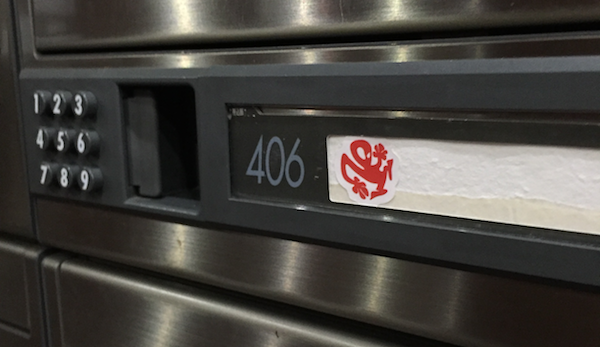
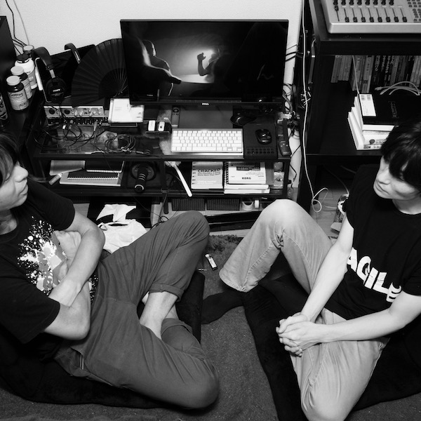
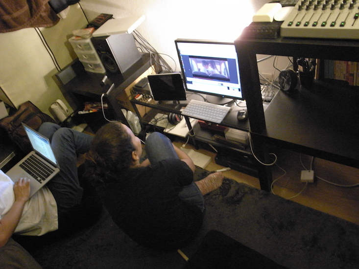
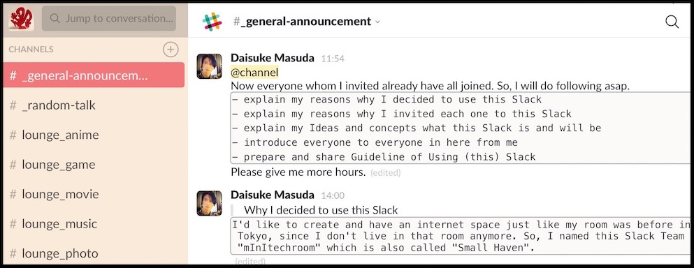

# mInItechroom

- The name of my room since I don't live in that room anymore
    - The room had been listed on Airbnb as "**Music Lovers enjoy this Small Haven**" Hosted by me (Daisuke).
- SSID of a Wi-Fi Router in that room

## mInItechroom Slack

**[Slack](https://slack.com/is)**
> *Team communication for the 21st century.*

- The place on the internet that had moved from physical place in Chiyoda, Japan
- Simply, It's an **internet chat room** on an invite-only basis

### I decided to create Slack Team

I'd like to create and have an internet space just like my room was before in Tokyo.

I'm a heavy user of Slack. It’s really necessary for me, for my work. Slack has been great tool to collaborate and communicate with team member. So, I created new Slack Team and named it **mInItechroom** on February 2017.

### My ideas and concepts for this Slack Team

- Like a house that it has many rooms (many Slack Channels) and **gathering spots** where we can talk/hangout
    - My room in Chiyoda was tiny studio having physical limits

When I just created the Slack Team, people who has invited from me were my friends who had the experience of staying in my room, and know at least one other person of the first member except me.

Please imagine it's nothing strange situation when you come to my room and meet other my friend first time and having new friendship. Also, I'd like you to invite your friends to join this Slack Team just as I would welcome you and your friend to my room.

Please simply treat the chatroom as like as my room. You can come anytime, you can leave (just leave for a while, or completely leave) anytime as well. I know there are many people not familiar to you when you joined first time. You can say something, you can keep silent and only read.

I hope here to be virtual Small Haven. Even now, I love Small Haven which had located in Chiyoda so much. Many people had came there and stayed and talked with me, sometimes with my friend as well. Then became friend each other.

### Public Channels

Only Owner (Me, Daisuke) can create new Public Channel. Ask me freely to create new Public Channel.

#### Meta Channels

- #_app-sandbox
- #_general-announcement
- #_random-talk

#### Lounge Channels

- #lounge_anime
- #lounge_game
- #lounge_movie
- #lounge_music
- #lounge_photo
- #lounge_tech
- #lounge_tv-drama

#### Room Channels

- #room_android-user
- #room_apple-user
- #room-developer
- #room_dj-musician
- #room_lang-exchange

### Recommended Usage

*I'm preparing document of using this Slack Team.*

#### Please keep joined in All Public Channels

Please don't leave from Public Channels. If you not interesting or you don't want to read specific channels, just mute notification.

#### Create Private Channel as you like

Everyone can create Private Channel on your purpose without any approval. Because I feel happy if you want to collabolate with specific people in here.

Only people in each Private Channel know it exists. I cannot know that If I haven't been invited even if I'm an owner of Slack Team.

#### Custom Theme

- `#F9EADA,#D6C3B5,#F2777A,#FFFFFF,#FFFFFF,#101010,#79e079,#66CCCC`

